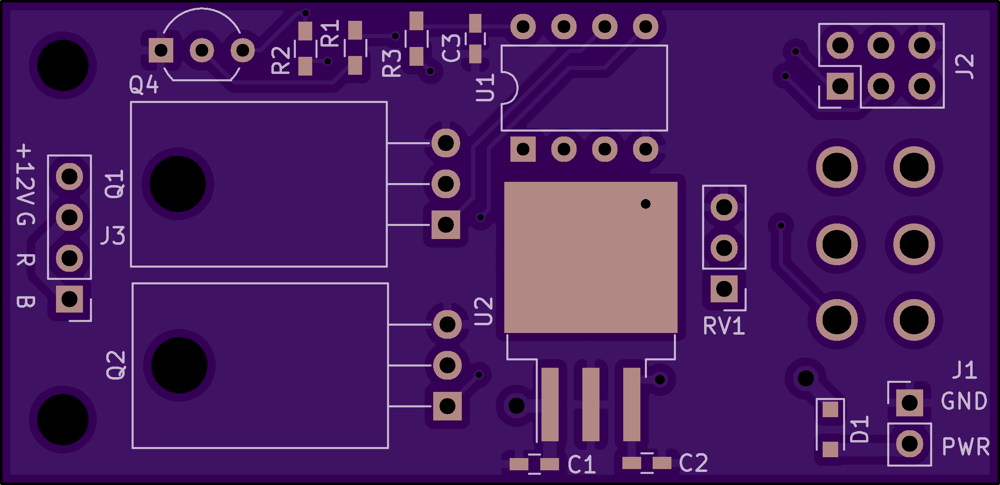

# LED Dimmer for Boat

KiCad design for a LED strip dimmer. Provides power and switch on/off
for the board. The dimmer controls are on-off-on switch and a
rheostat. If the switch is thrown one way, we get a dimmable white
light, and if thrown the other way, we get a dimmable red light from
the LED strip.

## Functions

1. Onboard ATtiny13A
2. Power is expected to be pigtailed and soldered to board

## Firmware

The firmware project:
 - 

PCB

